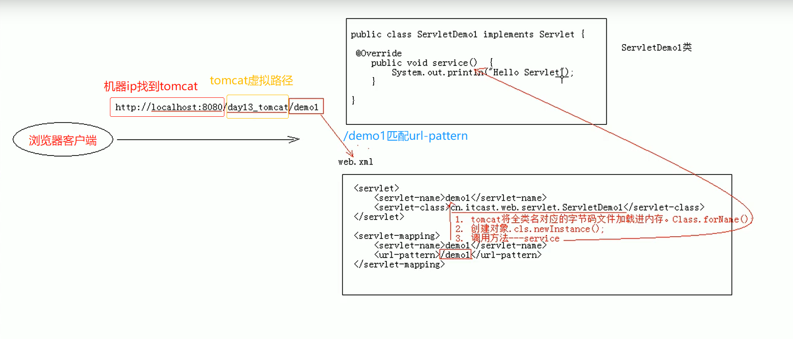

# Servlet

## 概念

```
* Servlet就是一个接口， 定义了Java类被浏览器访问到(tomcat识别)的规则。
* 将来我们定义一个类，实现Servlet接口，复写方法。
```

## 快速入门

```
1.创建javaEE项目
* 或者配置tomcat
* Servlet是在javaEE中的，需要导入

2.定义一个Servlet接口的实现类
public class ServletDemo1 implements Servlet{}

3.实现接口中的方法

4.配置Servlet
* 在web.xml中配置
    <servlet>
        <servlet-name>bieming</servlet-name>
        <servlet-class>cn.itcast.web.servlet.ServletDemo1</servlet-class>
    </servlet>
    <servlet-mapping>
        <servlet-name>bieming</servlet-name>
        <url-pattern>/testServlet</url-pattern>
    </servlet-mapping>
```

## 执行原理



```
1.当服务器接收到客户端浏览器的请求后，解析url，回去访问的Servlet资源路径
2.查找web.xml文件，是否有对应的<url-pattern>
3.如果有，则找到对应的<servlet-class>全类名
4.tomcat会将字节码文件加载进内存，并创建其对象
5.对象调用方法
```

## 生命周期

### init

```
被创建时：执行init，只执行一次；
* 什么时候创建
 * 默认第一次访问时，Servlet被创建
 * 可以配置Servlet的创建时机
 	1）第一次访问时，创建： 
 	<load-on-startup>为负数
 	2）在服务启动时，创建
 	<load-on-startup>为非负整数
 
* Servlet的init方法只执行一次，说明Servlet是单例对象
	* 多个用户同事访问时，可能存在线程安全问题；
	* 解决：尽量不要在Servlet中定义成员变量，即使定义了也不要修改它的值；
```


### service

```
提供服务：
每次访问Servlet时(调用接口时)执行，可执行多次；
```


### destory

```
被销毁时也就是服务正常关闭时执行，只执行一次
只有服务器正常关闭时会执行
destory是Servlet被销毁前执行，一般用于释放资源
```


### getServletInfo

```
获取Servlet的一些信息： 版本、作者等；
```


### getServletConfig

```
获取ServletConfig对象
ServletConfig: Servlet的配置对象
```


## Servlet3.0

### 好处

```
* 支持注解配置， 可以不需要web.xml
```

### 步骤

```
* 创建javaEE项目，选择servlet3.0+，可以不创建web.xml
* 定义一个类，实现Servl接口
* 复写方法
* 在类上使用WebServlet注解进行配置
	* 包名是 import javax.servlet.annotation.WebServlet;
	* @WebServlet("资源路径")
```

## Servlet的体系结构

### GenericServlet

```
* Servlet接口的实现类， 我们继承GenericServlet就可以写一个Servlet类了
* 定义： 
	* 将Servlet接口中其他方法做了默认空实现，只将service方法作空实现
	* 将来定义Servlet类时，可以寄继承GenericServlet，实现service方法即可
	
```

### HttpServlet

```
定义：对http协议的一种封装，简化操作
步骤：
	* 定义类继承HttpServlet
	* 复写doGet/doPost方法
```


## Servlet相关配置

### urlpartten: Servlet访问路径

```
1.一个servlet可以定义多个访问路径
@WebServlet({"/d4", "/dd4", "/ddd4"})

2.路径定义规则
	/XXX
	/XXX/XXX
	*.do
```

## ServletContext对象

### 1.概念

```
* 代表整个web应用， 可以和程序的容器（服务器）来通信
```

### 2.获取

```
1. 通过request对象获取
request.getServletContext();
2. 通过HttpServlet获取
this.getServletContext();
```

### 3.功能 

## Cookie会话

```
1. 概念：
* 客户端会话技术，将数据保存到客户端

2. 快速入门
* 使用步骤
	1. 创建Cookie对象，绑定数据
	Cookie c = new Cookie(String name, String value);
	2. 发送Cookie对象
	response.addCookie(c);
	3. 获取Cookie, 拿到数据
    Cookie[] cs = request.getCookies();
    if(cs != null){
        for (Cookie c : cs) {
            String name = c.getName();
            String value = c.getValue();
            System.out.println(name + ":" + value);
        }
    }
    
 3. 实现原理：
 * 基于响应头set-cookie和请求头cookie实现
 
 4. cookie细节
 * 一次是否能发送多个cookie
 	可以，
 	可以创建过个cookie，使用response调用多次addCookie方法发送cookie即可
 * cookie在浏览器中保存的时间
 	1）默认情况下，当浏览器关闭后，Cookie数据被销毁
 	2）持久化存储
 		* setMaxAge(int seconds);
 		正数： 将cookie数据写道硬盘文件中，持久化存储，cookie存活时间。
 		负数： 默认值（浏览器关闭，会话结束，清空cookie）。
 		0： 删除浏览器存储的指定cookie。
 		
 * cookie能不能存储中文
 	在tomcat8 之前 cookie 不能直接存储中文，需要数据转码
 	tomcat8 之后 cookie 可以直接存储中文
 
 * cookie获取范围多大
   1. 相同tomcat服务器中，部署了多个web项目，默认情况下，这些web项目的cookie不饿能共享
   * setPath(String path); 默认使用了web项目的虚拟路径，所以每个项目都不一样
   	如果想要共享， 则可以将path设置为 "/"
   	
   2. 不同tomcat服务器间cookie共享问题：
   * setDomain(String path): 如果设置一级域名相同，那么多个服务器间的cookie可以共享
   eg. setDomain(".baidu.com")
   tieba.baidu.com 和 news.baidu.com 可以cookie共享
   
 5. Cookie的特点和作用
 * cookie存储数据在客户端浏览器
 * 浏览器对单个cookie的大小限制4kb左右，对同域名下cookie总量限制20个左右
 
 作用：
	* cookie一般用于存储少量的不太敏感的数据
	* 在不登陆的情况下， 完成服务器对客户端的身份识别
```

