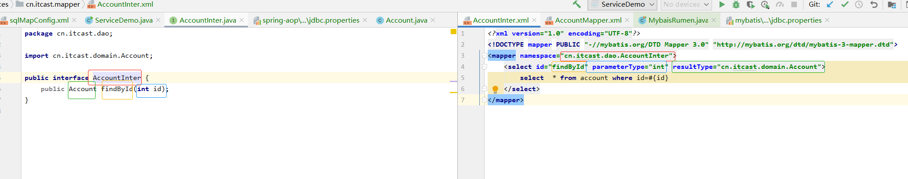

# Mybatis

## 1.入门

### 1.1概念

```
操作数据库的，对jdbc的封装。
使用xml配置：
	sqlMapConfig.xml: 配置 环境（全局配置入口，包括事务控制、数据源、映射sql的mapper）
	xxxMapper.xml: 配置对应模块的sql语句
自动封装数据到对象，不再需要在dao层手动处理数据
```


### 1.2例子


```
1. pom.xml中添加坐标
    <dependency>
      <groupId>mysql</groupId>
      <artifactId>mysql-connector-java</artifactId>
      <version>8.0.26</version>
    </dependency>
    <dependency>
      <groupId>org.mybatis</groupId>
      <artifactId>mybatis</artifactId>
      <version>3.5.1</version>
    </dependency>
2. 创建account表
3. 创建account表对应的实体类
4. 创建mybatis的全局环境配置文件 sqlMapConfig.xml文件
5. 创建对应模块的xxxMapper.xml文件，录入sql语句，并指定resultType
6. 编写测试类
	* 获取核心配置文件
	* 创建工厂对象
	* 创建session会话对象
	* 通过session会话对象调用指定mapper的sql语句
	* 关闭session会话，释放资源
```

## 2.增删改

```
* 当改变表数据时，例如增删改，这个时候需要提交事务
* jdbc会自动提交事务
* mybatis不会自动提交事务，所以需要我们操作完后，手动提交事务
```

### 2.1增

```
1. xxxMapper.xml中添加 插入sql
	<!--    添加用户-->
	parameterType： 参数类型
	resultType： 结果类型
    <insert id="insterAccount" parameterType="cn.itcast.domain.Account">
        insert into account values(#{id}, #{name}, #{wallet})
    </insert>
  
 2. 测试类，记得提交事务
    @Test
    public void test2() throws IOException {
        Account a = new Account();
        // 这里我们的id是自增的，所以可以不用传
        a.setName("mybatis02");
        a.setWallet(200);

        // 获取核心配置文件
        InputStream resourceAsStream = Resources.getResourceAsStream("sqlMapConfig.xml");
		// 创建工厂对象
        SqlSessionFactory build = new SqlSessionFactoryBuilder().build(resourceAsStream);
		// 获取session绘画对象
        SqlSession sqlSession = build.openSession();

        // 具体操作（执行哪个mapper的sql）
        sqlSession.update("accountTable.insterAccount", a);

        // 提交事务
        sqlSession.commit();

        // 释放资源
        sqlSession.close();
    } 
```

### 2.2改、删

```
* 增删改的代码基本一直，所以这里只列出核心代码

1. 改
	<!--    修改用户-->
    <update id="updateAccount" parameterType="cn.itcast.domain.Account">
        update account set name=#{name}, wallet=#{wallet} where id=#{id}
    </update>
    
    Account a = new Account(10, "mybatis02", 2000);
    sqlSession.update("accountTable.updateAccount", a);
    
 2. 删
 	<!--    删除用户-->
    <delete id="deleteAccount" parameterType="java.lang.Integer">
        delete from account where id=#{id}
    </delete>
    
    sqlSession.delete("accountTable.deleteAccount", 10);
```

## 3. Mybatis核心配置文件描述

```
* 主要配置的层级关系
```


.jpg)

### 3.1environments

```
* 数据库的环境配置， 支持多环境配置
```


.jpg)

```
* 其中，事务管理器(transactionManger)类型有两种, 一般都是使用JDBC

* 其中，数据源(dataSource)类型有三种， 一般使用POOLED
```

.jpg)

### 3.2mapper标签

```
* 通过路径，加载映射文件，有多种加载路径方式
* 一般使用第一种或者最后一种
```

.jpg)

### 3.3properties

```
* 引入外部properties，解耦
```

.jpg)

### 3.4typeAliases

```
* 设置别名
```

.jpg)

### 3.5 typeHandlers类处理器

#### 3.5.1概念

```
* mybatis会使用内置的typeHandler处理我们 java->数据库、数据库->java 的数据类型转换
* 但内置的typeHandlers并不能满足我们的需求、场景，所以需要自定义typeHandlers
```

#### 3.5.2自定义typeHandler

```
步骤：
	第一步： 实现org.apache.ibatis.type.TypeHandler接口 或 继承org.apache.ibatis.type.BaseTypeHandler
	第二步： 实现 或 重写 里面的四个方法， 一个是 java->数据库  三个是 数据库->java
	第三步： 在mybatis的核心配置文件sqlMapConfig.xml中配置typeHandlers
	第四步： 写测试类测试
```

.jpg)

### 3.6plugin

```
* 拓展mybatis的功能

* 步骤
	- 导入坐标
	<dependency>
      <groupId>com.github.pagehelper</groupId>
      <artifactId>pagehelper</artifactId>
      <version>3.7.5</version>
    </dependency>
    <dependency>
      <groupId>com.github.jsqlparser</groupId>
      <artifactId>jsqlparser</artifactId>
      <version>0.9.1</version>
    </dependency>
    
    - mybatis的核心配置文件sqlMapConfig.xml中配置plugin
	<!--    分页插件配置-->
    <plugins>
        <plugin interceptor="com.github.pagehelper.PageHelper">
	<!--            指定方言-->
            <property name="dialect" value="mysql"/>
        </plugin>
    </plugins>  
    
    - 写接口、 在mapper中映射sql语句
    public List<Account> findAll();
    
    <sql id="selectAccount">
        select  * from account
    </sql>

    <select id="findAll" resultType="cn.itcast.domain.Account">
        <include refid="selectAccount"></include>
    </select>
    
    - 写测试类，使用PageHelper初始化分页、使用PageInfo获取分页信息
        // 分页功能实现
        PageHelper.startPage(1, 3);

        List<Account> all = mapper.findAll();
        for (Account account1 : all) {
            System.out.println(account1);
        }
        // 自动结合上面信息，获取分页信息
        PageInfo<Account> accountPageInfo = new PageInfo<Account>(all);
        long total = accountPageInfo.getTotal();
        int pageSize = accountPageInfo.getPageSize();
        System.out.println("总页数：" + pageSize);
        System.out.println("总条数：" + total);    
```

.jpg)

## 4.代理对象实现dao

### 4.1与传统对比

`代理对象`与`传统实现`的区别在于： 不再需要给dao的接口写**实现类**，mybatis会自动根据mapper命名空间把**mapper的sql**和**接口的方法**做映射。

### 4.2 代理实现的注意点

```
1. Mapper.xml文件中的namespace与mapper接口的全限命名相同
2. Mapper接口方法名和Mapper。xml中定义的每一个statement的id相同
3. Mapper接口方法的输入参数类型和Mapper。xml中定义的每个sql的parameterType的类型相同
4. Mapper接口方法的输出类型和Mapper。xml中定义的每个sql的resultType的类型相同
5. 写测试类
	与之前不用的是： 拿到sqlSession后，我们不再使用命名空间的方式调用sql，而是获取对应的mapper，然后再调用sql
	AccountInter mapper = sqlSession.getMapper(AccountInter.class);
	Account account = mapper.findById(2);
```



### 4.3例子

.jpg)

## 5.动态sql

### 5.1场景

```
* 有些sql语句是不固定的，会根据搜索条件而改变。
* 例如条件搜索，有可能根据name或者name、age、id一起关联查找等
```

### 5.2例子

#### 5.2.1if控制

```
* 核心代码
    <select id="findByInfo" resultType="cn.itcast.domain.Account" parameterType="cn.itcast.domain.Account">
        select * from account
        <where>
            <if test="id!=0">
                and id=#{id}
            </if>
            <if test="name!=null">
                and name=#{name}
            </if>
            <if test="wallet">
                and wallet=#{wallet}
            </if>
        </where>
    </select>
* 根据if条件动态生成 sql语句
```


.jpg)

#### 5.2.2foreach遍历

```
* 核心代码
    <select id="findByIds" parameterType="list" resultType="cn.itcast.domain.Account">
        select * from account 
        <where>
            <foreach collection="list" open="id in (" close=")" separator="," item="id">
                #{id}
            </foreach>
        </where>
    </select>
* 根据foreach条件动态拼接生成 sql语句
```


.jpg)

#### 5.2.3sql片段抽取

```
* 将重复的sql语句抽出，作为公共代码引入，解耦
* 核心代码
	* 抽离
    <sql id="selectAccount">
        select  * from account
    </sql>	
    * 引入
    <select id="findById" parameterType="int" resultType="cn.itcast.domain.Account">
        <include refid="selectAccount"></include>
        where id=#{id}
    </select>
```

.jpg)

## 6.多表查询

```
* 多表查询涉及到表的设计，以及主键外键的关联
	http://www.manongjc.com/article/15405.html

* mybatis多表查询时，在一个对象中的属性也是一个对象时，要做映射，这个时候我们需要使用到resultMap
```


### 6.1一对一

.jpg)

```
* 1.建表
	- 创建 account表
create table account(
 id int primary key auto_increment,
 name varchar(16),
 birthday varchar(16),
 wallet varchar(16)
);	
	- 创建 orders表
create table orders(
 id int primary key auto_increment,  // 主键
 account_id int unique,
 date varchar(16),
 money varchar(16),
 foreign key(account_id) references account(id) // 设置外键
 on delete cascade
 on update cascade
);	

* 2.建类
public class Account {
    private int id;
    private String name;
    private int wallet;
    private Date birthday;
    ...
}
public class Order {
    private int id;
    private Date date;
    private double money;
    private Account account;
    ...
}

* 3.建接口
public interface AccountInter {

}
public interface OrderInter {
    public Order findById();
}

* 4.建映射mapper.xml
<mapper namespace="cn.itcast.dao.OrderInter">
	// ☆resultMap用来映射order.account的信息，也可以说是重新把order的属性和数据表列重新组织对应关系
    <resultMap id="orderMap" type="cn.itcast.domain.Order">
        <id column="oid" property="id"></id>
        <result column="date" property="date"></result>
        <result column="money" property="money"></result>
        // <result column="name" property="account.name"></result>
        // <result column="wallet" property="account.wallet"></result>
        // <result column="birthday" property="account.birthday"></result>
        // <result column="aid" property="account.id"></result>
        // 处理order.account的地方
         <association property="account" javaType="cn.itcast.domain.Account">
            <result column="name" property="name"></result>
            <result column="wallet" property="wallet"></result>
            <result column="birthday" property="birthday"></result>
            <result column="aid" property="id"></result>
        </association>
    </resultMap>

    <select id="findById" resultMap="orderMap">
    	// 使用外键简历关联关系，一对一关联查找
        select *, o.id oid, a.id aid from orders o, account a where o.account_id=a.id;
    </select>
</mapper>

* 5.编写测试类
public class TestOrder {
    @Test
    public void test1() throws IOException {
        // 获取核心配置文件
        InputStream resourceAsStream = Resources.getResourceAsStream("sqlMapConfig.xml");
        // 创建工厂对象
        SqlSessionFactory build = new SqlSessionFactoryBuilder().build(resourceAsStream);
        // 获取session绘画对象
        SqlSession sqlSession = build.openSession();
        OrderInter mapper = sqlSession.getMapper(OrderInter.class);
        Order order = mapper.findById();
        System.out.println(order);
    }
}
```

