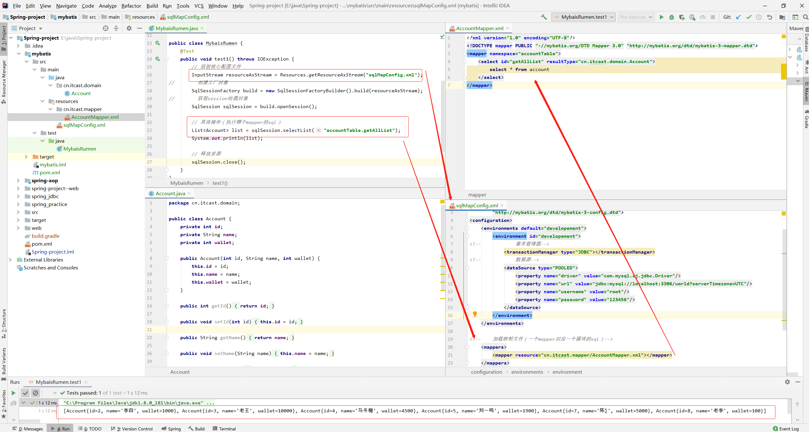

# Mybatis

## 1.入门

### 1.1概念

```
操作数据库的，对jdbc的封装。
使用xml配置：
	sqlMapConfig.xml: 配置 环境（全局配置入口，包括事务控制、数据源、映射sql的mapper）
	xxxMapper.xml: 配置对应模块的sql语句
自动封装数据到对象，不再需要在dao层手动处理数据
```


### 1.2例子



```
1. pom.xml中添加坐标
    <dependency>
      <groupId>mysql</groupId>
      <artifactId>mysql-connector-java</artifactId>
      <version>8.0.26</version>
    </dependency>
    <dependency>
      <groupId>org.mybatis</groupId>
      <artifactId>mybatis</artifactId>
      <version>3.5.1</version>
    </dependency>
2. 创建account表
3. 创建account表对应的实体类
4. 创建mybatis的全局环境配置文件 sqlMapConfig.xml文件
5. 创建对应模块的xxxMapper.xml文件，录入sql语句，并指定resultType
6. 编写测试类
	* 获取核心配置文件
	* 创建工厂对象
	* 创建session会话对象
	* 通过session会话对象调用指定mapper的sql语句
	* 关闭session会话，释放资源
```

## 2.增删改

```
* 当改变表数据时，例如增删改，这个时候需要提交事务
* jdbc会自动提交事务
* mybatis不会自动提交事务，所以需要我们操作完后，手动提交事务
```

### 2.1增

```
1. xxxMapper.xml中添加 插入sql
	<!--    添加用户-->
	parameterType： 参数类型
	resultType： 结果类型
    <insert id="insterAccount" parameterType="cn.itcast.domain.Account">
        insert into account values(#{id}, #{name}, #{wallet})
    </insert>
  
 2. 测试类，记得提交事务
    @Test
    public void test2() throws IOException {
        Account a = new Account();
        // 这里我们的id是自增的，所以可以不用传
        a.setName("mybatis02");
        a.setWallet(200);

        // 获取核心配置文件
        InputStream resourceAsStream = Resources.getResourceAsStream("sqlMapConfig.xml");
		// 创建工厂对象
        SqlSessionFactory build = new SqlSessionFactoryBuilder().build(resourceAsStream);
		// 获取session绘画对象
        SqlSession sqlSession = build.openSession();

        // 具体操作（执行哪个mapper的sql）
        sqlSession.update("accountTable.insterAccount", a);

        // 提交事务
        sqlSession.commit();

        // 释放资源
        sqlSession.close();
    } 
```

### 2.2改、删

```
* 增删改的代码基本一直，所以这里只列出核心代码

1. 改
	<!--    修改用户-->
    <update id="updateAccount" parameterType="cn.itcast.domain.Account">
        update account set name=#{name}, wallet=#{wallet} where id=#{id}
    </update>
    
    Account a = new Account(10, "mybatis02", 2000);
    sqlSession.update("accountTable.updateAccount", a);
    
 2. 删
 	<!--    删除用户-->
    <delete id="deleteAccount" parameterType="java.lang.Integer">
        delete from account where id=#{id}
    </delete>
    
    sqlSession.delete("accountTable.deleteAccount", 10);
```

## 3. Mybatis核心配置文件描述

```
* 主要配置的层级关系
```


.jpg)

### 3.1environments

```
* 数据库的环境配置， 支持多环境配置
```


.jpg)

```
* 其中，事务管理器(transactionManger)类型有两种, 一般都是使用JDBC

* 其中，数据源(dataSource)类型有三种， 一般使用POOLED
```

.jpg)

### 3.2mapper标签

```
* 通过路径，加载映射文件，有多种加载路径方式
* 一般使用第一种或者最后一种
```

.jpg)

### 3.3properties

```
* 引入外部properties，解耦
```

.jpg)

### 3.4typeAliases

```
* 设置别名
```

.jpg)

