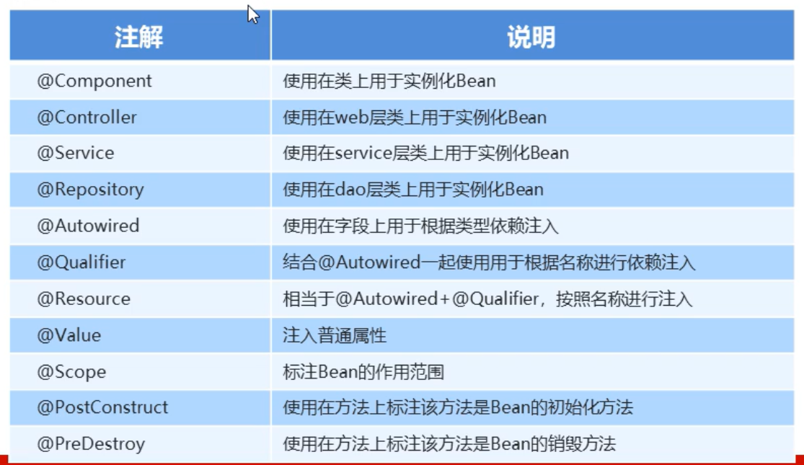
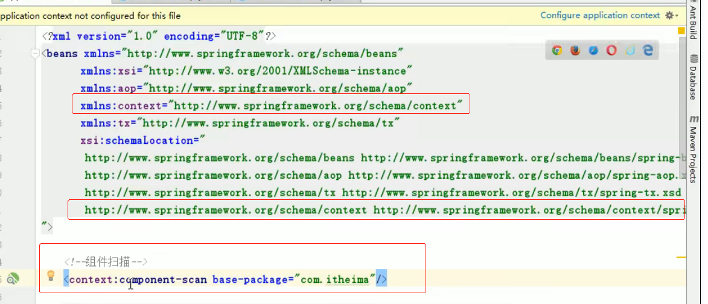

1.Spring

## 1.Spring简介

```
* 是分层的JAVA SE/EE应用全栈轻量级框架
* IOC: 控制反转
* AOP: 面向切面编程
* 提供了展现层Spring MVC 和 持久层Spring JDBCTemplate 以及 业务层事务管理
* 整合开源师姐总舵注明的第三方框架和类库，逐渐成为使用最多的Java EE 企业应用开源框架
```

## 2.Spring快速入门

.jpg)

```
1. 导入Spring开发的基本包坐标
* pom.xml中配置依赖坐标
    <dependency>
      <groupId>org.springframework</groupId>
      <artifactId>spring-context</artifactId>
      <version>5.3.13</version>
    </dependency>
    
2. 编写Dao接口和实现类
    public interface UserDao {
        public void say();
    }

3. 创建Spring核心配置文件
resources下创建Spring config文件， 命名随意，但是一般叫applicationContext.xml

4. 在Spring配置文件中配置UserDaoImpl
	// Dao接口的实现类UserDaoImpl，配置成bean
	<bean id="userDao" class="cn.itcast.dao.impl.UserDaoImpl"></bean>
5. 使用Spring的API获取Bean实例
	// 测试类中使用bean
    public class UserDaoDemo {
        public static void main(String[] args) {
            ClassPathXmlApplicationContext app = new ClassPathXmlApplicationContext("applicationContext.xml");
            UserDao user = (UserDao) app.getBean("userDao");
            user.say();
        }
    }
```

## 3.Spring配置文件

### 3.1Bean配置

```
* 用于配置对象交由Spring来创建
* 默认情况下它调用的是类中的无参构造方法

基本属性：
	* id： Bean实例在Spring容器中的唯一标识
	* class： Bean的全限定名称
```

### 3.2Bean标签范围配置

```
* scope: 指对象的作用范围，取值如下
1. singleton: 默认值，单例的
Bean实例化时机： 当Spring核心配置文件被加载时
对象销毁时机： 当应用卸载、销毁容器是，对象被销毁

2. prototype: 多例的
Bean实例化时机：当调用getBean()方法时实例化Bean
对象销毁时机：当对象长期不使用，被java的垃圾回收器回收

3. request: web项目中，Spring创建一个Bean对象，将对象存入到request域中
4. session: web项目中，Spring创建一个Bean对象，将对象存入到session域中
5. global session: web项目中，应用Portlet环境，如果没有portlet环境那么globalSession相当于session

```

### 3.3Bean声明周期配置

```
* init-method: 指定类中的初始化方法名称

* destory-method: 指定类中销毁的方法名称
eg. 
// 在实现类中定义初始化、销毁方法实现。在.xml文件的bean中配置对应初始化和销毁名称的方法名
<bean id="userDao" class="cn.itcast.dao.impl.UserDaoImpl" scope="singleton" init-method="init" destroy-method="destory"></bean>

```

### 3.4Bean实例三种方式

```
* 无参构造方法实例化  最重要
	<bean id="userDao" class="cn.itcast.dao.impl.UserDaoImpl"></bean>

* 工厂静态方法实例化  了解
    public class StaticFactory {
        public static UserDaoImpl getUserDao(){
            return new UserDaoImpl();
        }
    }
    <bean id="userDao" class="cn.itcast.dao.factory.StaticFactory" factory-method="getUserDao"></bean>

* 工厂实例方法实例化  了解
    public class Factory {
        public UserDaoImpl getUserDao(){
            return new UserDaoImpl();
        }
    }
    <bean id="factory" class="cn.itcast.dao.factory.Factory"></bean>
    <bean id="userDao" factory-bean="factory" factory-method="getUserDao"></bean>   
```

## 4.Spring依赖注入 IOC

```
* 场景：
	web层   			调用         service层
	service层		调用			dao层
这样的调用方式： web层 =》 service层  =》 dao层，其实我们只关心web层调用service层，所以service层调用dao层的交由Spring管理，我们可以使用 IOC 依赖注入实现
* 依赖注入两种实现方式： 
	1. set方法
	2. 带参构造函数
```

### 4.1 set依赖注入

```
1）UserService类中的set方法
    private UserDaoImpl userDaoImpl;

    public void setUserDaoImpl(cn.itcast.dao.impl.UserDaoImpl userDaoImpl) {
        this.userDaoImpl = userDaoImpl;
    }
2）配置文件 
	* 不使用 p命名空间， 推荐使用这种方式
    <bean id="userDao" class="cn.itcast.dao.impl.UserDaoImpl"></bean>
    <bean id="userService" class="cn.itcast.service.impl.UseService">
        <property name="userDaoImpl" ref="userDao"></property>
    </bean>
    name=userService： 指UserService类中 setUserService
    ref： 指用哪个Bean注入
    注入普通属性： 不用ref，用value
   * 使用 p 命名空间
   xmlns:p="http://www.springframework.org/schema/p"
   <bean id="userService" class="cn.itcast.service.impl.UseService" p:userDaoImpl-ref="userDao"></bean>
   要添加命名空间
   p:userDaoImpl-ref="对象"， p:userDaoImpl="非引用类型"
    
```

### 4.2 带参构造方法注入

```
1）UserService类中的 带参构造方法
    private UserDaoImpl userDaoImpl;

    public UseService(UserDaoImpl userDaoImpl) {
        this.userDaoImpl = userDaoImpl;
    }

2） xml配置文件
	<bean id="userDao" class="cn.itcast.dao.impl.UserDaoImpl"></bean>
    <bean id="userService" class="cn.itcast.service.impl.UseService">
        <constructor-arg name="userDaoImpl" ref="userDao"></constructor-arg>
    </bean>
    name="userDaoImpl"： 构造方法，形参名
    ref="userDao"： Bean的id
```

### 4.3 import划分模块

```
eg 
	<import resource="xxx.xml">
```

## 5.注解开发

```
	Spring是一个 重配置 轻代码的框架， 通过注解减小xml配置文件体积， 简化和提升开发速度。
	
* 步骤：
	1. 使用@Component("BeanId") @Controller、 @Service、 @Repository等代替 xml中的bean配置
	2. 使用@Autowired配合Qualifier("BeanId") 实现依赖注入
		而且使用这种方式注入的话，类中对应的set方法可以不写
	  * 如果知识按照类型注入，可以直接写 @Autowried
	  * 如果按照BeanId注入， 需要@Autowried 和 Qualifier("BeanId")同时写
	  * @Resource: 相当于 @Autowried 和 Qualifier("BeanId")同时写
		
	3. 在xml文件中配置扫描包路径， 告知Spring需要去扫描哪些包的注解，自动创建Bean并注入Spring容器中
	 eg.  <context:component-scan base-package="包名"></context:component-scan>
	
```

### 5.1原始注解

```
* Spring原始注解主要是替代<Bean>的配置
```



### 5.2 新注解

.jpg)

```

```

## 6.Spring整合Servlet

### 6.1 自实现版本

```
1. 将初始Spring容器储存到servletContext共享域下
public class ContextListenerLoader implements ServletContextListener {
    public void contextInitialized(ServletContextEvent servletContextEvent) {
    	// 核心代码
        ClassPathXmlApplicationContext app = new ClassPathXmlApplicationContext("applicationContext.xml");
        ServletContext servletContext = servletContextEvent.getServletContext();
        servletContext.setAttribute("app", app);
        System.out.println("spring监听器初始化完毕。。。。");
    }

    public void contextDestroyed(ServletContextEvent servletContextEvent) {

    }
}

2. 配置web.xml中listenter监听器， 执行全类名指定的类
  <listener>
    <listener-class>cn.itcast.listener.ContextListenerLoader</listener-class>
  </listener>
  
3. 通过servletContext对象共享域获取Spring容器，取到想要的Bean
public class UseServlet extends HttpServlet {
    @Override
    protected void doGet(HttpServletRequest req, HttpServletResponse resp) throws ServletException, IOException {
        ServletContext servletContext = this.getServletContext();
        ApplicationContext app = (ApplicationContext)servletContext.getAttribute("app");
        UseServiceImpl useService = (UseServiceImpl)app.getBean("useService");
        useService.save();
    }
}
```

### 6.2 Spring集成版本

```
* Spring提供了一个监听器ContextLoaderListener，自动根据web.xml的配置，创建Spring容器，并注入到ServletContext共享域中，提供了一个WebApplicationContextUtils供使用者获取Spring容器。

第一步： 
	pom.xml导入依赖， spring-web
	
第二步： 
	web.xml中配置全局初始化参数
      <context-param>
        <param-name>contextConfigLocation</param-name>
        <param-value>classpath:applicationContext.xml</param-value>
      </context-param>	
      监听器
   	  <listener>
    	<listener-class>org.springframework.web.context.ContextLoaderListener</listener-class>
  	  </listener> 
 
 第三步： 
 	获取Spring容器上下文
 public class UseServlet extends HttpServlet {
    @Override
    protected void doGet(HttpServletRequest req, HttpServletResponse resp) throws ServletException, IOException {
        ServletContext servletContext = this.getServletContext();
        WebApplicationContext app = WebApplicationContextUtils.getWebApplicationContext(servletContext);
        UseServiceImpl useService = (UseServiceImpl)app.getBean("useService");
        useService.save();
    }
}	
```

## 7.Spring JDBCTemplate

```
* Spring 对jdbc操作数据库的封装  --- jdbcTemplate
```

### 7.1JdbcTemplate开发步骤

```
1. 导入spring-jdbc和spring-tx坐标
        <dependency>
            <groupId>org.springframework</groupId>
            <artifactId>spring-jdbc</artifactId>
            <version>5.3.14</version>
        </dependency>
        <dependency>
            <groupId>org.springframework</groupId>
            <artifactId>spring-tx</artifactId>
            <version>5.3.14</version>
        </dependency>

2. 创建jdbc连接对象
    @Test
    public void searchData() throws PropertyVetoException {
        ComboPooledDataSource dataSource = new ComboPooledDataSource();
        dataSource.setDriverClass("com.mysql.cj.jdbc.Driver");
        dataSource.setJdbcUrl("jdbc:mysql://localhost:3306/world?serverTimezone=UTC");
        dataSource.setUser("root");
        dataSource.setPassword("123456");

        JdbcTemplate jdbcTemplate = new JdbcTemplate();
        jdbcTemplate.setDataSource(dataSource);

        int row = jdbcTemplate.update("insert into account values(?,?,?)", null, "老李", 3500);
        System.out.println(row);
    }
        
3. 操作数据库
        int row = jdbcTemplate.update("insert into account values(?,?,?)", null, "老李", 3500);
        System.out.println(row);
```

### 7.2利用Spring的IOC注入 ★

```
1. 导入坐标
    <dependency>
        <groupId>org.springframework</groupId>
        <artifactId>spring-core</artifactId>
        <version>5.3.14</version>
    </dependency>
    
2. 配置jdbc.properties外部配置文件
    jdbc.driver=com.mysql.cj.jdbc.Driver
    jdbc.url=jdbc:mysql://localhost:3306/world?serverTimezone=UTC
    jdbc.user=root
    jdbc.password=123456

3. applicationContext.xml文件
    <!--    导入外部配置-->
    <context:property-placeholder location="classpath:Jdbc.properties"/>

    <!--    配置数据源-->
    <bean id="dataSource" class="com.mchange.v2.c3p0.ComboPooledDataSource">
        <property name="driverClass" value="${jdbc.driver}"></property>
        <property name="jdbcUrl" value="${jdbc.url}"></property>
        <property name="user" value="${jdbc.user}"></property>
        <property name="password" value="${jdbc.password}"></property>
    </bean>

    <!--    配置JdbcTemplate对象-->
    <bean id="jdbcTemplate" class="org.springframework.jdbc.core.JdbcTemplate">
        <property name="dataSource" ref="dataSource"></property>
    </bean>
 
 4. 使用
	 @Test
     public void insertData(){
        ApplicationContext app = new ClassPathXmlApplicationContext("applicationContext.xml");
        JdbcTemplate jdbcTemplate = app.getBean(JdbcTemplate.class);
        int row = jdbcTemplate.update("insert into account values(?, ?, ?)", null, "陈∑", 5000);
        System.out.println(row);
    }
 
```

### 7.3测试JdbcTemplate修改操作

- 使用spring-test测试

  ```
  * 导入坐标： spring-test、 junit (junit的版本必须是4.12以上)
          <dependency>
              <groupId>junit</groupId>
              <artifactId>junit</artifactId>
              <version>4.13.2</version>
              <scope>test</scope>
          </dependency>
          <dependency>
              <groupId>org.springframework</groupId>
              <artifactId>spring-test</artifactId>
              <version>5.3.14</version>
          </dependency>
  ```

- 增删改都是使用update

  ```
  @RunWith(SpringJUnit4ClassRunner.class)
  @ContextConfiguration("classpath:applicationContext.xml")
  public class TestJdbcTemplate02 {
      @Autowired  // 在xml文件中配置了bean，使用注解注入
      JdbcTemplate jdbcTemplate;
  
      @Test  // 修改操作
      public void testUpdate(){
          int row = jdbcTemplate.update("update account set wallet=? where name=?", 10000, "老王");
          System.out.println(row);
      }
  
      @Test // 删除操作
      public void testDelete(){
          int row = jdbcTemplate.update("delete from account where name=?", "老李");
          System.out.println(row);
      }
      
      @Test // 添加操作
      public void testAdd(){
          int row = jdbcTemplate.update("insert into account values(?,?,?)", null, "老李", 100);
          System.out.println(row);
      }
  }
  ```

- 查找操作

  ```
      @Test  // 查找所有
      public void testQueryAll(){
          List<Account> query = jdbcTemplate.query("select * from account", new BeanPropertyRowMapper<Account>(Account.class));
          System.out.println(query);
      }
  
      @Test  // 条件查找
      public void testQueryOne(){
          Account account = jdbcTemplate.queryForObject("select * from account where name=?", new BeanPropertyRowMapper<Account>(Account.class), "老王");
          System.out.println(account);
      }
  
      @Test  // 聚合查找
      public void testQueryCount(){
          Long aLong = jdbcTemplate.queryForObject("select count(*) from account", Long.class);
          System.out.println(aLong);
      }
  ```


## 8.aop切面编程

### 8.1概念步骤

```
* aop: 面向切面编程（对目标对象方法进行增强）
  提升开发效率： 不用在每个需要增强的方法那里写重复的增强
  解耦： 使用配置的方式，在执行期间，也就是在内存中动态生成代理对象进行增强，所以不需要对需要增强的方法作任何操作

* aop的底层实现： 
	-- 基于JDK的动态代理
	-- 基于Cglib的动态代理
  Spring会根据是否有对应接口，有对应接口就执行JDK动态代理， 没有就执行Cglib动态代理
  
 * aop的重点概念：
 	Pointcut(切入点): 被增强的方法
 	Advice(通知、增强): 封装增强业务的方法
 	Aspect(切面): 切点+通知
 	Weaving(织入): 将切点与通知结合的过程
 	
 * 开发明确事项：
 	谁是切点(切点表达式配置)
 	谁是通知(切面类中的增强方法)
 	将切点和通知进行织入配置
```

### 8.2xml配置

.jpg)

```
1. 导入坐标
    <dependency>
      <groupId>org.springframework</groupId>
      <artifactId>spring-context</artifactId>  // context中有aop，但是aspectjweaver切面写得更好，所以官网处理后建议使用两者结合使用
      <version>5.3.15</version>
    </dependency>
    <dependency>
      <groupId>org.aspectj</groupId>
      <artifactId>aspectjweaver</artifactId>
      <version>1.9.8.RC3</version>
    </dependency>
2. 创建切点class （有需要被增强的方法）
3. 创建切面class （有用来增强的方法）
4. applicationContext.xml
	* 添加aop命名空间
	* 注入切点和切面bean
	* 织入
		在切面bean中指定 增强类型、增强使用的方法、那个方法需要被增强
5. 使用spring-test、junit等写测试类AopTest，测试aop切面
```

### 8.3 事务控制

```
是对aop的一种实现，对指定范围的类和方法进行事务控制（增强）；
当被事务管理的整个方法执行正常时，才会运行；
若中间出现错误，直接回滚；
一般用在业务层，阻止语法错误导致 操作数据库数据错误
```


#### 8.3.1xml配置

.jpg)

```java
1. pom.xml中导入坐标
    <dependency>
      <groupId>org.springframework</groupId>
      <artifactId>spring-tx</artifactId>
      <version>5.3.15</version>
    </dependency>
    
2. applicationContext.xml中
  * 添加tx命名空间
  *	<!--    配置平台事务管理器 和上面的jdbcTemplate有点像-->
    <bean id="transactionManger" class="org.springframework.jdbc.datasource.DataSourceTransactionManager">
        <property name="dataSource" ref="dataSource"></property>
    </bean>

  *	<!--    通知： 事务的增强-->
    <tx:advice id="txAdvice" transaction-manager="transactionManger">
        事务属性的配置： 方法、超时时间、是否只读等
        <tx:attributes>
            <tx:method name="*"/>
        </tx:attributes>
    </tx:advice>

  *	<!--    织入： 事务的aop织入-->
    <aop:config>
    	指定使用 指定事务 管理 指定范围的类的方法
        （使用 txAdvice事务 管理 cn.itcast.shiwu包下所有类的所有方法）
        <aop:advisor advice-ref="txAdvice" pointcut="execution(* cn.itcast.shiwu.*.*(..))"></aop:advisor>
    </aop:config>
    
3. 编写测试类
```

#### 8.3.2 注解配置

1. 将所有的bean都改成注解bean，通过扫描包在applicationContext.xml中导入



2. 在需要被事务增强的类或者方法上添加注解： @Transactional

   类注解： 类中所有的方法都将被这个事务控制

   方法注解： 该方法将使用这个事务控制

   .jpg)

3. 在applicationContext.xml中配置事务的注解驱动

   .jpg)

